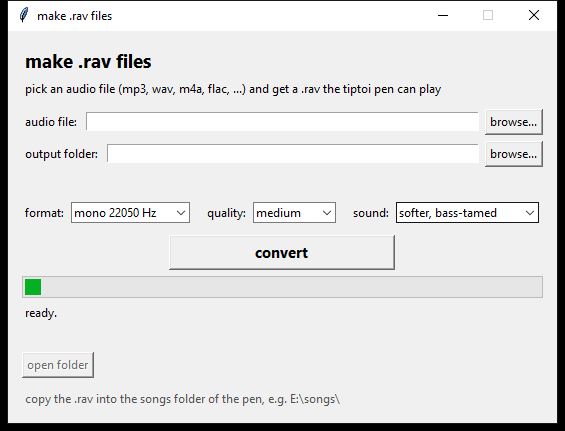

# RAVage — tiptoi-`.rav`-Audio-Konverter

[English](README.md) · **Deutsch**

Wandle **beliebige Audiodateien** (mp3, wav, m4a, flac, ogg, …) in eine
abspielbare `.rav`-Datei für den **Ravensburger tiptoi-Stift (3203L)** um —
und wieder zurück.

Die RAV-Verschlüsselung des 3203L wurde komplett aus der Firmware-Datei
(`Update3203L.upd`) per Thumb-2-Disassembly rekonstruiert. Alles hier ist von
Grund auf implementiert und byte-exakt gegen Original-Dateien des Stifts
verifiziert. Soweit wir wissen ist das die erste funktionierende
Implementierung überhaupt — die Community hatte das Format vor über zehn
Jahren als „ernsthafte Crypto“ abgehakt
([Issue #115](https://github.com/entropia/tip-toi-reveng/issues/115)).



## Fertige Programme

Ohne Python — die passende Datei für dein Betriebssystem gibt es auf der
[Releases-Seite](https://github.com/Markthegamer108/RAVage/releases) (oder in
den Artifacts des letzten Workflow-Laufs):

| OS | Was du bekommst | Hinweise |
|----|-----------------|----------|
| Windows | `ravage-windows.zip` — `ravage.exe` (GUI) + `ravage-cli.exe` | `ravage.exe` doppelklicken |
| macOS | `ravage-macos.tar.gz` — `ravage.app` + `ravage-cli` | nicht signiert, erster Start: Rechtsklick → Öffnen |
| Linux | `ravage-linux.tar.gz` — `ravage` (GUI) + `ravage-cli` | bei Bedarf `chmod +x` |

Alles ist mit dabei — ffmpeg, Key-Tabelle, der ganze Rest. Gebaut werden die
Programme von GitHub Actions (siehe `.github/workflows/build.yml`).

### Getestete Hardware

Auf echter Hardware verifiziert: **tiptoi-Stift Gen 2 (3203L)**. Andere
Stift-Generationen nutzen dieselbe RAV-Dateifamilie, aber ihre Firmware
unterscheidet sich — die Key-Tabelle wird aus der Firmware des jeweiligen
Stifts extrahiert (`data/keytable.bin` stammt aus `Update3203L.upd`). Ein
Gen-3-Stift müsste also erst mit eigenen Original-Dateien/Firmware
gegengeprüft werden. Falls du einen hast und testen willst: der Decryptor
(`rav_cli.py decrypt`) ist dein Freund.

## Schnellstart

### GUI (am einfachsten)

```bat
run_gui.bat
```

oder

```
python rav_gui.py
```

Audiodatei aussuchen, Zielordner wählen, **Convert to .rav** drücken und die
Datei in den Musikordner des Stifts kopieren (z. B. `E:\songs\Mein Lied.rav`).

### CLI

```
python rav_cli.py convert "Mein Lied.mp3" -o "Mein Lied.rav"
python rav_cli.py decrypt "Old MacDonald Had a Farm.rav" -o song.ogg   # Forschung
```

## So funktioniert's

Eine `.rav`-Datei ist ein 0x20-Byte-Header gefolgt von einem
**Ogg-Vorbis**-Audiostream (mono, 22050 Hz), verschlüsselt mit einer simplen
Keyed-Byte-Transformation. Der Stift ignoriert die Ogg-Page-CRCs — der
Chiffretext muss also keine gültigen CRCs enthalten.

### Header (20 Bytes)

| Offset | Größe | Bedeutung |
|-------:|------:|-----------|
| 0x00 | 16 | Magic `Ravensburgerv03\0` |
| 0x10 | 2  | `value16` (Little-Endian) |
| 0x12 | 1  | Flag, immer `0xBE` |
| 0x13 | 8  | Key-Blob: `TABLE[value16 + 3 + i] ^ key8[i]` |
| 0x1B | 5  | Trailer, fest `4E 6C 31 F2 65` |

### Schlüsselableitung

```
key8     = "CommonI2"
checksum = (sum(key8) + value16) & 0xFFFF          # z. B. 0x78 → 0x035C
keystream[i] = TABLE[(checksum + i) & 0xFFF]        # 512 Bytes
```

Die 4096-Byte-`TABLE` ist eine feste Key-Tabelle aus der Firmware
(Datei-Offset `0xDBADC`, Speicheradresse `0x008EDADC`), hier beigelegt als
`data/keytable.bin`.

### Body-Chiffre

Wird auf den Payload ab Datei-Offset `0x20` angewendet:

```
kb = keystream[(pos - 0x20) & 0x1FF]
op = pos & 3

op 0  XOR mit Pass-through:  wenn c ∈ {0x00, 0xFF, kb} oder (c ^ kb) == 0xFF
                            → c unverändert lassen, sonst out = c ^ kb
op 1  out = (c - kb) & 0xFF
op 2  out = (c + kb) & 0xFF
op 3  out = c ^ kb            (keine Pass-through-Regeln)
```

Die Pass-through-Regeln (im Firmware-Loop bei `0x8DF3B4` verifiziert)
existieren, damit eine Byte-Kollision mit dem Keystream nie einen Wert
erzeugt, der den Decoder verwirren würde. Der Encoder spiegelt sie exakt
wider (`op 0`: wenn der Klartext `0x00`, `0xFF`, `kb` oder `kb ^ 0xFF` ist,
unverändert ausgeben) — dadurch ist die Verschlüsselung **verlustfrei**:
Offizielle Stift-Dateien sind an diesen Stellen verlustbehaftet, unsere sind
byte-exakte Roundtrips.

> **Metadaten sind wichtig:** Der Stift lehnt Streams mit zu großem
> Vorbis-Comment-Header ab (YouTube-Rips schleppen z. B. eine riesige
> eingebettete „Synopsis“ mit — ein ~9-KB-Header scheitert, ~3,6 KB
> funktioniert, das entspricht auch der Größe der Original-Dateien). Der
> Konverter entfernt daher alle Metadaten (`-map_metadata -1`).

> **Klangformung:** Standardmäßig wendet der Konverter eine sanfte
> „gezähmte“ Kette an — Hochpass bei 70 Hz (der kleine Lautsprecher des
> Stifts kann keinen Subbass, der macht die Wiedergabe nur matschig), −4 dB
> Gain und ein −1-dB-Peak-Limiter. Die GUI bietet „Much softer“ (−8 dB) und
> „Original loudness“ (ohne Verarbeitung); das CLI hat `--gain-db` und
> `--no-tame`.

## Wie das Knacken lief

Kurzfassung für alle, die den Weg mögen. Keine Side-Channels, keine
geleakten Keys — alles war offen sichtbar.

1. **Der Kaninchenbau.** Das Wiki und Issue #115 (2015 geschlossen)
   erklärten RAV-Dateien zu „ernsthafter Crypto“ und spekulierten, der
   Schlüssel könnte auf einem Chip pro Stift liegen. ~10 Jahre lang hat
   niemand es geknackt.

2. **Die Firmware.** Ravensburger stellt das Firmware-Update des Stifts
   (`Update3203L.upd`) direkt auf der Website bereit — ein schlichtes
   Cortex-M-Image (ARM Thumb-2), keine nennenswerte Verschleierung.

3. **Den Audiopfad finden.** Suche im Image nach dem RAV-Magic
   `Ravensburgerv03` → landet bei der Audio-Open-Funktion bei `0x8DFE84`,
   die einen Key-Generator (`0x8DF380`) und die Decode-Schleife (`0x8DF3B4`)
   aufruft.

4. **Das „Geheimnis“ war öffentlich.** Der Key-Generator baut einen
   512-Byte-Keystream aus `key8 = "CommonI2"` (ein fest verdrahteter String
   in der Firmware) plus einer 4096-Byte-Tabelle bei Datei-Offset `0xDBADC`.
   Jeder Stift wird mit seinem eigenen Entschlüsselungsschlüssel
   ausgeliefert — ein Pro-Stift-Geheimnis gab es nie. Es ist keine
   Kryptografie, sondern ein schicker XOR mit einer Lookup-Tabelle.

5. **Verifizieren, scheitern, fixen.** Die ersten Versuche waren auf dem PC
   perfekte Roundtrips, aber der Stift weigerte sich, unsere Dateien
   abzuspielen: Der Keystream-Index ist payload-relativ (`pos - 0x20`), der
   Op-Selector dagegen absolut (`pos & 3`). Die falsche Phase verschiebt den
   gesamten Stream. Dieses Detail hat ein paar Tage gekostet.

6. **Die Eigenheiten.** Der Stift ignoriert Ogg-Page-CRCs (schlampiger
   Decoder — unser Glück) und lehnt Streams mit fetten
   Vorbis-Comment-Headern ab — ein ~9-KB-YouTube-Rip-Header scheitert, die
   ~3,6-KB-Größe der Originale funktioniert.

7. **Echte Hardware.** Old MacDonald. Olchi. Drei Chinesen mit dem
   Kontrabass. Alles entschlüsselt zu `OggS`; eigene Dateien spielen auf dem
   Stift. Fertig.

## Reverse-Engineering-Notizen

- Firmware: `Update3203L.upd` — Cortex-M-Image (ARM Thumb-2); Datei-Offset →
  Speicher `+ 0x00812000`.
- Audio-Open-Funktion: `0x8DFE84`; Key-Generator: `0x8DF380`
  (`KEY[i] = TABLE[(checksum + i) & 0xFFF]`, beachte: die Maske greift nur
  auf `checksum + i`); Body-Chiffre-Loop: `0x8DF3B4`.
- `0x8DF2FC` / `0x8DF340` sind nur Init/Aufräumen — keine
  Schlüsselableitung.
- Werksdateien wurden mit `key8 = b"CommonI2"` und `value16 = 0x78` auf allen
  vier Original-Dateien entschlüsselt; die Payloads sind alle Ogg Vorbis
  (mono 22050 Hz).

### `data/keytable.bin` neu erzeugen

```python
from rav_tool import ravcrypto
ravcrypto.extract_keytable(r"C:\Pfad\zu\Update3203L (1).upd", "data/keytable.bin")
```

## Abhängigkeiten

- Python 3.8+
- `ffmpeg` im PATH **oder** `pip install imageio-ffmpeg` (statischer Build)
- `numpy` (optional — reine Python-Fallback-Implementierung enthalten,
  ~10× langsamer)

## Dateien

```
rav_gui.py / rav_gui.pyw   GUI-Konverter (doppelklickfreundlich)
rav_cli.py                 Kommandozeilen-Konverter + Decryptor
rav_tool/ravcrypto.py      die RAV-Chiffre, Header bauen/parsen, Key-Tabelle
rav_tool/convert.py        ffmpeg-Wrapper (jedes Format → Ogg Vorbis)
data/keytable.bin          aus der Firmware 3203L extrahierte Key-Tabelle
```

## Lizenz

MIT — frei nutzbar, studierbar, teilbar.

## Community

Dieses Projekt baut auf der Vorarbeit der
[tip-toi-reveng](https://github.com/entropia/tip-toi-reveng)-Community und
ihrem [Wiki](https://github.com/entropia/tip-toi-reveng/wiki) auf. Das
RAV-Format war das letzte große ungelöste Stück — schau vorbei auf der
[tiptoi-Mailingliste](https://lists.nomeata.de/mailman/listinfo/tiptoi) und
sag Hallo.
